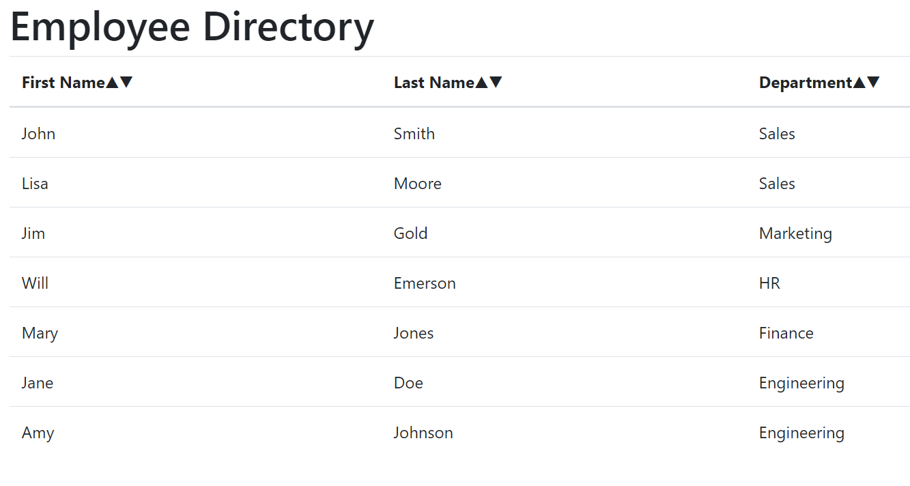

# Employee Directory

## Table of Contents

* [General Info](#general-info)
* [Technologies](#technologies)
* [How to Use](#how-to-use)
* [Application Demo](#application-demo)
* [Application Link](#application-link)
* [License](#license)
* [Contact](#contact)

## General Info

An application that, using React, allows users to view an employee directory, which includes the employees first and last names and departments, as well as sort their first names, last names, or departments alphabetically in descending or ascending order.

## Technologies

* JavaScript
* React
* CSS

## How to Use

To run this application locally:

* Clone or download the repository
* Open the code in your preferred code editor
* Open the integrated terminal in the code editor
* Run npm install in the terminal
* Enter npm start in the terminal

After following these steps, the application will open on local host 3000 in your browser.

## Application Demo

## Application Link

[Employee Directory](https://joneskm72.github.io/employee-directory/)

## License

## Contact

Email: jones.m.kasey@gmail.com

GitHub: https://github.com/joneskm72